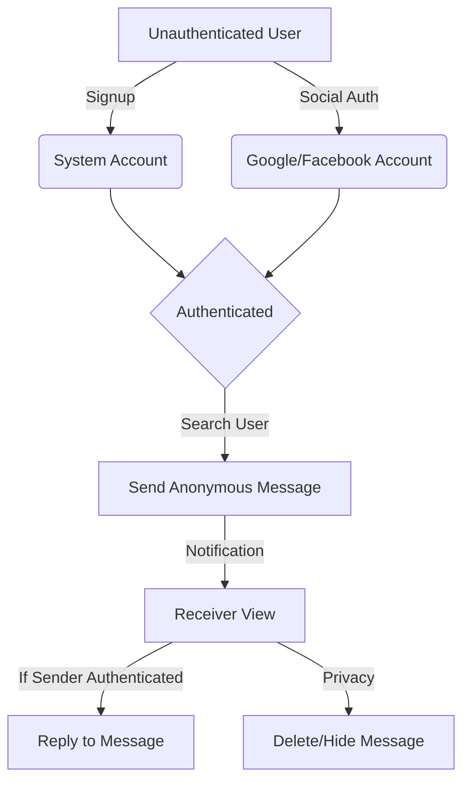
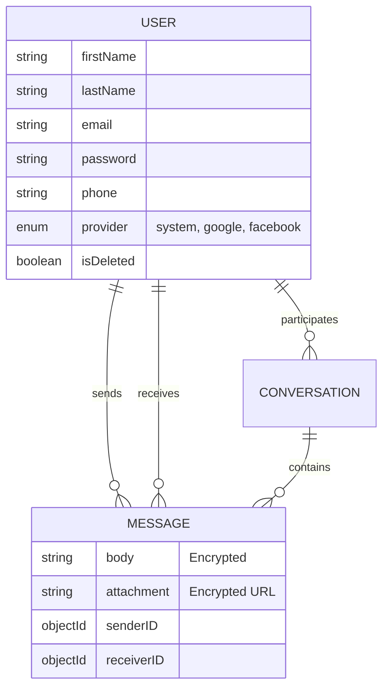

# Saraha Application Documentation

Saraha is a secure anonymous messaging platform that allows users to send hidden messages to registered users. Built with a focus on privacy, security, and scalability.

## 🚀 Overview

- **Architecture**: RESTful API (Node.js / Express)
- **Database**: MongoDB with Mongoose ODM
- **Cache Layer**: Redis (token revocation, OTP, rate limiting)
- **Security Level**: High — encrypted messages, hashed passwords, 2FA, rate limiting

---

## 🛠️ System Architecture

### User Flow


### Database Schema (Entity Relationship)


---

## 📁 Folder Structure

The project uses a feature-based modular architecture:

```text
saraha/
├── src/
│   ├── modules/
│   │   ├── user/ (model, controller, service, router, validation)
│   │   ├── message/ (model, controller, service, router, validation)
│   │   └── conversation/ (model, controller, router)
│   ├── middleware/ (auth, validation, rateLimit, upload)
│   ├── utils/ (hash, encryption, token, email, otp, redis)
│   ├── config/ (db, redis, env)
│   ├── repositories/ (user, message)
│   └── app.js
├── keys/ (private.key, public.key)
└── uploads/
```

---

## 📋 Data Models

### User Model
| Field | Type | Required | Notes |
| :--- | :--- | :--- | :--- |
| `firstName`/`lastName` | String | Yes | Min 2, Max 50 chars |
| `email` | String | Yes | Unique, lowercase |
| `password` | String | Conditional | Hashed (Argon2+Bcrypt) |
| `provider` | Enum | Yes | system, google, facebook |
| `role` | Enum | Yes | user, admin |
| `isDeleted` | Boolean | Yes | Soft delete flag |

### Message Model
| Field | Type | Required | Notes |
| :--- | :--- | :--- | :--- |
| `body` | String | Conditional | Encrypted text/emoji |
| `attachment` | String | Conditional | Encrypted file URL |
| `senderID` | ObjectId | No | Null if anonymous |
| `receiverID` | ObjectId | Yes | Recipient User ID |

---

## 🔌 API Endpoints

### Authentication & User
- `POST /api/auth/signup`: Register new user (system)
- `POST /api/auth/login`: Login & receive JWT + Refresh Token
- `POST /api/auth/facebook-login`: Authenticate via Facebook Access Token
- `POST /api/auth/google-login`: Authenticate via Google ID Token
- `POST /api/auth/logout`: Revoke token via Redis (**Bearer**)
- `GET /api/users/profile`: Get own profile (**Bearer**)
- `DELETE /api/users/me`: Soft delete account (**Bearer**)

### Messaging
- `POST /api/messages`: Send anonymous message (**Optional Auth**)
- `GET /api/messages/inbox`: Get all received messages (**Bearer**)
- `DELETE /api/messages/:id`: Soft delete a message (**Bearer**)

### Conversations
- `POST /api/conversations`: Create or get existing conversation (**Bearer**)
- `GET /api/conversations`: List all conversations (**Bearer**)

---

## 🔐 Security Architecture

### 1. Password Hashing (Hybrid Strategy)
1. **Argon2id**: Memory-hard, resistant to GPU attacks.
2. **Bcrypt**: Adds time-cost and wide compatibility.
*Attacker must break both algorithms to recover a password.*

### 2. Message Encryption
- **Algorithm**: AES-256-GCM (Symmetric) for bodies.
- **Key Exchange**: RSA-OAEP (Asymmetric) for AES keys.
- **Storage**: Keys stored encrypted alongside messages.

### 3. JWT Architecture
- **Algorithm**: RS256 (Asymmetric - RSA keys).
- **Access Token**: Short-lived (15 min).
- **Refresh Token**: Long-lived (7 days), stored in Redis.
- **Revocation**: Blacklist in Redis on logout/password change.
- **Provider Check**: Validates `iat` against `credentialChangedAt` to force logout on security changes.

### 4. Social Authentication
- **Facebook**: Backend verifies the `accessToken` via the Facebook Graph API (`/me`).
- **Google**: Backend verifies the `idToken` using `google-auth-library` and checks the `audience` against the client ID.
- **Auto-Provisioning**: Users are automatically registered on first social login if their email is verified and unique.

---

## 🗺️ Implementation Roadmap

### Section 1-4: Foundation & Validation
- Folder Structure, Hybrid Hashing, Asymmetric Tokens.
- Social Login (Google), Joi Schema Validation.
- Multer for File Uploads (DiskStorage, Size Limits).

### Section 5-8: Advanced Features & Security
- Redis Integration (TTL, Token Revocation).
- NodeMailer & OTP Logic (Max trials, expiry).
- Security Middleware (CORS, Helmet, Rate Limiting).
- Deployment (PM2, EvenNode, Ngrok SSL).
